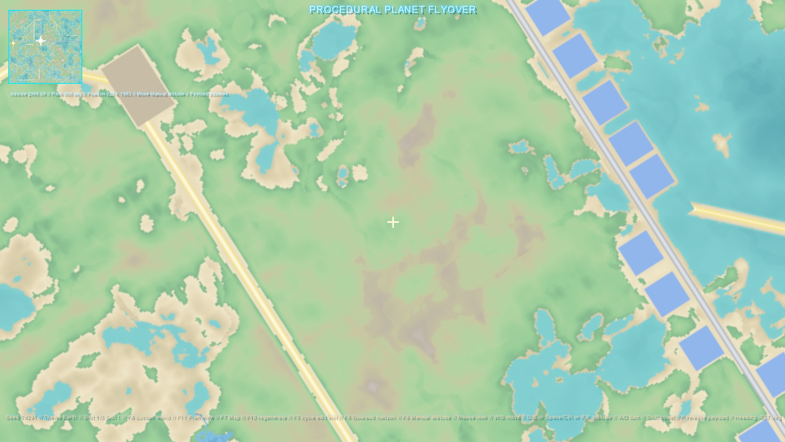
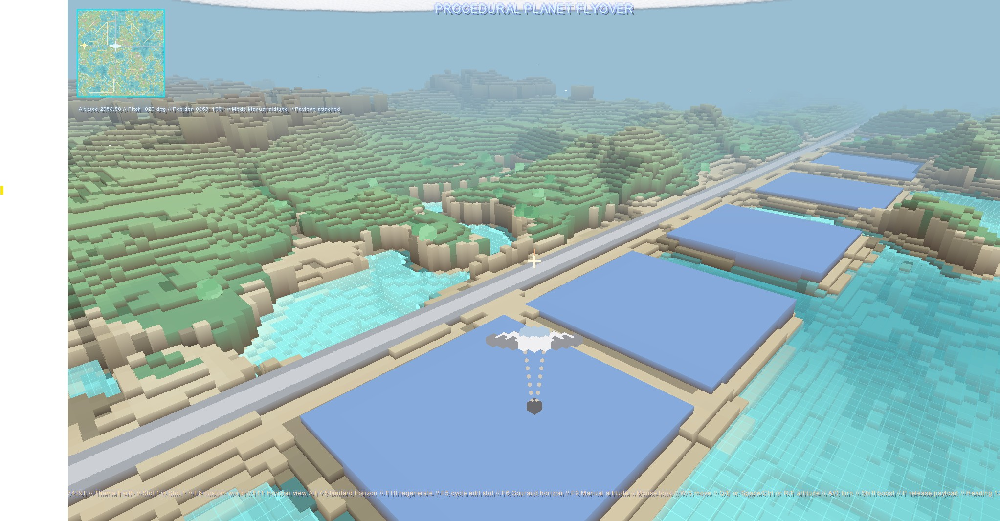
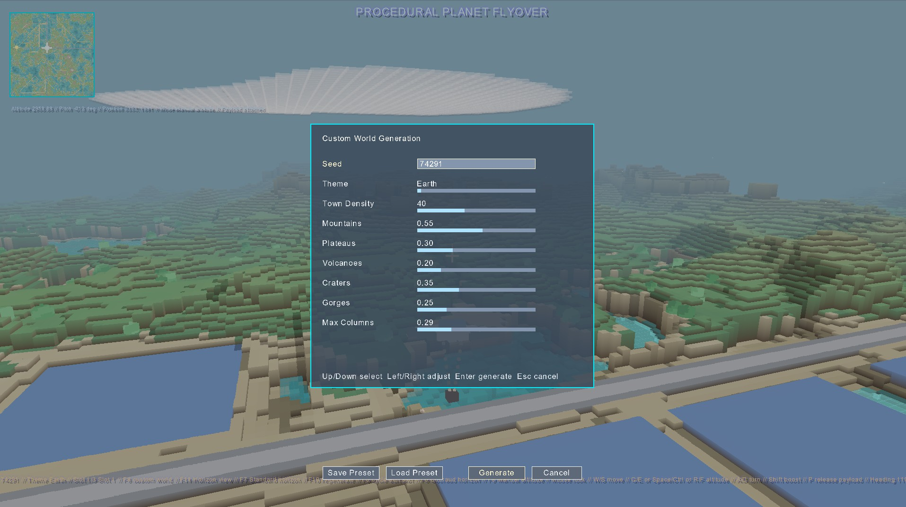
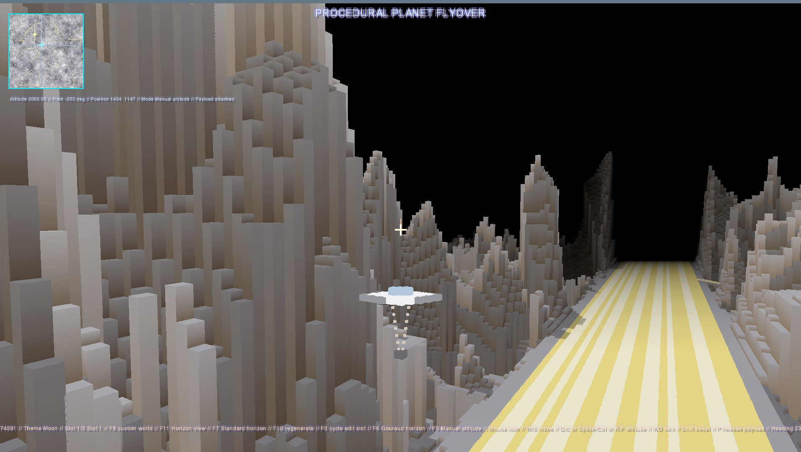
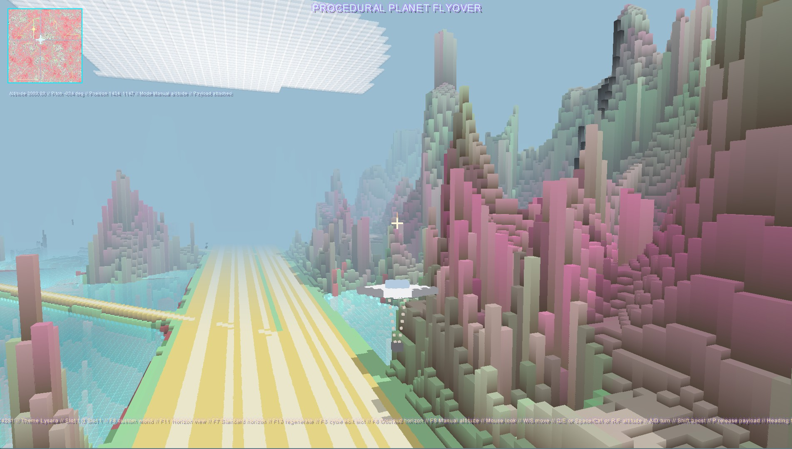

# PETAR-PlanetExplorer

PETAR-PlanetExplorer is a procedural planet flyover and exploration prototype built with .NET 8 and MonoGame DesktopGL.
It generates large stylized planets, lets the player switch between a strategic plan view and an immersive world view, and includes gameplay systems such as payload deployment, oil rig placement, missile-based terrain destruction, terrain-follow flight, procedural themes, switchable flat/Gouraud horizon shading, an alternate voxel-style horizon renderer, and a drivable truck vehicle that can be used on development sites with orbit camera control, terrain-responsive tilt, and terrain-aware camera clipping.

This README is intended to document the current state of the project for development, maintenance, and GitHub check-in.

## Main Game View







The follow captured video is jerky,  but it demonstrates the core gameplay systems in action. The game runs in 60 frames at present.

<video src="./Graphics/Videos/petar.mp4" controls muted loop playsinline width="960">
  Your browser does not support embedded video playback. Download the video from <code>./Graphics/Videos/petar.mp4</code>.
</video>

## Table of Contents

- [Overview](#overview)
- [Current Feature Set](#current-feature-set)
- [Technology Stack](#technology-stack)
- [Project Structure](#project-structure)
- [Requirements](#requirements)
- [Build and Run](#build-and-run)
- [Controls](#controls)
- [World Generation](#world-generation)
- [Planet Themes](#planet-themes)
- [Flight Model and Views](#flight-model-and-views)
- [Payload, Oil Rigs, and Missile System](#payload-oil-rigs-and-missile-system)
- [Rendering Model](#rendering-model)
- [Terrain Destruction Model](#terrain-destruction-model)
- [Logging and Diagnostics](#logging-and-diagnostics)
- [Benchmark Project](#benchmark-project)
- [Known Limitations](#known-limitations)
- [Suggested Next Improvements](#suggested-next-improvements)

---

## Overview

The project centers on a procedurally generated planet represented as a large wrapped terrain map.
Players can:

- generate new planets from seeds and tunable terrain settings
- switch between a top-down plan view and a 3D world view
- fly a ship in real time with mouse-look and altitude control
- deploy payloads that become oil platforms on impact
- fire missiles in world view to carve craters into the terrain
- explore multiple built-in and generated visual themes

The game uses a stylized voxel-column renderer in world view rather than a true volumetric 3D voxel world.
That design choice enables a large world size while keeping the terrain pipeline relatively lightweight.

---

## Current Feature Set

### Core gameplay

- Procedural planet generation
- Seed-based world creation
- Custom world generation dialog
- Top-down plan view
- 3D horizon/world view
- Mouse look in world view
- Manual altitude mode
- Terrain-follow flight mode
- Ship collision against terrain
- Payload release and falling payload simulation
- Oil rig placement from payload impact
- Missile firing in world view only
- Missile max range and impact detonation
- Terrain destruction from spherical blast radius
- Missile debris rendering
- Multiple visual themes including many generated/randomized themes
- Procedural development sites, roads, and towns
- Town defense missile-post visuals that track the craft without firing
- TAB-based switching between the ship and a drivable truck
- Truck terrain-follow driving with visual body tilt over slopes and terrain-step collision for larger obstacles

### Visual systems

- Voxel-column terrain rendering
- Switchable flat/Gouraud shading in the standard horizon renderer
- Water surface rendering
- Cloud rendering
- Birds in life-supporting worlds
- Ship rendering
- Truck rendering
- Ship engine particle effects
- Volcano smoke effects
- Oil platform smoke effects
- Venus bubble columns and non-life surface-water rendering
- HUD and loading overlays
- Minimap and development-site markers
- Fog-based atmospheric depth
- Alternate voxel horizon renderer
- Orbit camera for the truck vehicle with mouse-wheel zoom and terrain-aware camera distance

### Development support

- Debug log output to file
- Separate benchmark project for renderer-related profiling

---

## Technology Stack

- .NET 8
- MonoGame DesktopGL
- C#
- Microsoft Visual Studio Community 2026 (current development environment noted in workspace)

---

## Project Structure

```text
README.md
BenchmarkSuite1/
PETAR-PlanetExplorer/
  Program.cs
  PETARPlanetExplorer.cs
  Content/
  modules/
	debug/
	GameObjects/
	MapObjects/
	maps/
	Player/
	UI/
```

### Important files and folders

#### Root
- `README.md` - repository documentation

#### Main game
- `PETAR-PlanetExplorer/Program.cs`
  - application startup
  - debug logger initialization and shutdown

- `PETAR-PlanetExplorer/PETARPlanetExplorer.cs`
  - core game loop
  - input handling
  - flight logic
	 - truck movement and vehicle switching
  - world generation orchestration
  - payload handling
  - missile simulation
	 - minimap refresh and gameplay state
   - world-view renderer and shading toggles

#### Terrain and map systems
- `PETAR-PlanetExplorer/modules/maps/ProceduralWorldMap.cs`
  - procedural terrain generation
  - height sampling
	 - development sites, roads, towns, and minimap data
   - rivers
  - trees
  - volcano vent detection
  - terrain destruction for missile impacts

- `PETAR-PlanetExplorer/modules/maps/WorldGenerationSettings.cs`
  - generation parameter model and defaults

- `PETAR-PlanetExplorer/modules/maps/PlanetTheme.cs`
	 - built-in and generated planet themes
   - explicit non-life water support and themed sea colors

- `PETAR-PlanetExplorer/modules/maps/HeightMapFlyoverRenderer.cs`
	- horizon flyover world renderer
  - visible chunk generation
  - fog and camera setup
	 - switchable flat/Gouraud terrain shading
   - water, terrain, smoke, cloud, bubble, and object draw flow

#### Game/world objects
- `PETAR-PlanetExplorer/modules/GameObjects/HeightMapFlyoverRenderer.OilRig.cs`
  - oil platform and smoke rendering

- `PETAR-PlanetExplorer/modules/GameObjects/HeightMapFlyoverRenderer.Missile.cs`
  - missile render state and debris visuals

- `PETAR-PlanetExplorer/modules/GameObjects/HeightMapFlyoverRenderer.TownDefense.cs`
  - town-edge missile tower and launcher visuals

#### Ship and entity visuals
- `PETAR-PlanetExplorer/modules/Player/HeightMapFlyoverRenderer.Ship.cs`
  - ship model rendering
  - payload visual behavior
  - ship engine particle effects

- `PETAR-PlanetExplorer/modules/Player/HeightMapFlyoverRenderer.Truck.cs`
  - truck model rendering
  - rotating wheel visuals
  - fixed chase-camera support constants

- `PETAR-PlanetExplorer/modules/MapObjects/HeightMapFlyoverRenderer.Trees.cs`
  - tree rendering

- `PETAR-PlanetExplorer/modules/MapObjects/HeightMapFlyoverRenderer.Birds.cs`
  - bird rendering and movement

#### UI
- `PETAR-PlanetExplorer/modules/UI/GenerationDialog.cs`
  - world generation settings dialog
  - keyboard and mouse support

- `PETAR-PlanetExplorer/modules/UI/FlyoverOverlay.cs`
  - loading and HUD overlays

#### Logging
- `PETAR-PlanetExplorer/modules/debug/DebugLogger.cs`
  - file-based logging
  - unhandled exception logging

#### Benchmarks
- `BenchmarkSuite1/`
  - benchmarking support for renderer behavior

---

## Requirements

To build and run the project locally:

- .NET 8 SDK
- Visual Studio with .NET desktop tooling or equivalent CLI support
- Desktop/OpenGL-capable environment suitable for MonoGame DesktopGL

---

## Build and Run

### Visual Studio

1. Open the repository in Visual Studio.
2. Load the solution containing:
   - `PETAR-PlanetExplorer/PETAR-PlanetExplorer.csproj`
   - `BenchmarkSuite1/BenchmarkSuite1.csproj`
3. Set `PETAR-PlanetExplorer` as the startup project.
4. Build and run.

### Command line

From the repository root:

```powershell
cd PETAR-PlanetExplorer
 dotnet build
 dotnet run
```

If using the solution root:

```powershell
dotnet build
```

---

## Controls

### General
- `Esc` - exit
- `Tab` - switch between the ship and the truck
- `F12` - toggle fullscreen
- `F11` - toggle between plan view and world view
- `F10` - regenerate the world with a random seed
- `F8` - open world generation dialog
- `F7` - toggle the alternate voxel horizon renderer
- `F6` - toggle standard horizon shading between Gouraud and flat (`Gouraud` starts enabled)
- `F5` - cycle the active terrain edit slot
- `F9` - toggle terrain-follow flight mode

### Flight movement
- `W` / `S` or `Up` / `Down` - forward / reverse
- `A` / `D` or `Left` / `Right` - turn
- `Shift` - boost

### Truck movement
- `W` / `S` or `Up` / `Down` - drive forward / reverse
- `A` / `D` or `Left` / `Right` - steer the truck
- `Shift` - faster truck movement

### Vertical movement
- Ascend:
  - `Q`
  - `PageUp`
  - `Space`
  - `R`
- Descend:
  - `E`
  - `PageDown`
  - `LeftCtrl`
  - `RightCtrl`
  - `F`

### Mouse
- In world view, mouse movement controls look direction.
- When driving the truck, mouse movement orbits the camera around the truck.
- Mouse wheel zooms the truck camera in and out.

### Gameplay actions
- `P` - release payload / deploy oil platform payload
- `M` - fire missile (world view only)

---

## World Generation

The planet is generated procedurally from a seed and a group of tunable parameters.

### Current generation parameters
- Seed
- Theme
- Town density
- Mountain intensity
- Plateau intensity
- Volcano intensity
- Crater intensity
- Gorge intensity
- Max cube columns
- Tree count (theme-dependent)

### Current defaults
Defined in `WorldGenerationSettings.cs`:

- Seed: `74291`
- Mountains: `0.55`
- Plateaus: `0.30`
- Volcanoes: `0.20`
- Craters: `0.35`
- Gorges: `0.25`
- Max cube columns: `96`
- Town density: `40`

### Notes on generation behavior
- Plateaus have been broadened and flattened compared to earlier shaping.
- Volcanoes have been widened and can emit smoke from sparse detected vents.
- Development sites can generate as flat central pads with outbound roads.
- Town density is configurable from `0` to `100` in the generation dialog.
- Towns, town roads, and defense sites are distributed procedurally across the world.
- Themes can change whether trees and birds are active, while surface water is now theme-specific and can also appear on non-life worlds.

---

## Planet Themes

The project includes:

- built-in hand-authored themes such as Earth, Mercury, Venus, Mars, and Moon
- many generated/randomized themes with deterministic contrasting color pairs
- full-range terrain color banding across the height spectrum for generated themes

### Theme behavior
- Earth-like themes can support water, trees, and birds
- non-life themes disable trees and birds, but can still render themed seas when the selected theme supports surface water

### Current special water/theme behavior
- Venus renders a deep green sea with large animated bubble columns rising from water areas
- generated alien themes can render deterministic rich primary-color seas

### Generated theme notes
Generated themes are not random at runtime per frame.
They are deterministic from theme identity and use contrasting HSV-derived colors spread across the full terrain band range.

---

## Flight Model and Views

### Plan view
- top-down wrapped map view
- intended for strategic orientation and global awareness
- shows the minimap-style world layout clearly

### World view
- forward/horizon-style voxel rendering
- default Gouraud-shaded terrain in the standard horizon renderer
- optional alternate voxel horizon renderer on `F7`
- mouse-look flight
- orbit camera when driving the truck
- fog and atmospheric depth
- world object rendering (ship, truck, trees, oil rigs, smoke, clouds, birds, town defenses, Venus bubbles)

### Flight systems
- manual altitude control
- terrain-follow mode
- collision against terrain and ship footprint
- custom ship placement relative to the camera

### Ground vehicle systems
- a truck spawns on a development site when the world is generated
- the truck is built from one-eighth-size cubes with a long flat bed and scaled cab
- the truck has four rotating wheels that animate while moving
- the truck tilts up and down to match terrain slope
- the truck can drive over normal terrain blocks and stops on larger terrain steps
- the truck camera moves inward when terrain would clip through the view
- vehicle control switches between ship and truck with `Tab`

### Ship positioning
The ship is rendered just below the center crosshair in world view and recent collision fixes aligned gameplay placement with renderer placement.

---

## Payload, Oil Rigs, and Missile System

### Payload and oil rig system
- Payload can be released from the ship.
- Payload falls under its own motion.
- On impact, an oil platform is placed on the impacted cube center and top height.
- Oil rigs include their own platform geometry and animated smoke.

### Missile system
Missiles are available only in world view.

Current missile behavior:
- Fired with `M`
- Starts from the ship position
- Fires in line with the center cross / current look direction
- Travels up to `300` cubes maximum
- Explodes on terrain impact or max range
- Uses a spherical blast with default radius `10`
- Preserves terrain columns from cube heights `0` through `4`
- Produces visual debris after explosion
- Rebuilds terrain visuals after impact

### Current missile limitations
- One active missile at a time
- Debris is visual-only, lightweight debris rather than full rigid-body chunk simulation
- Destruction is heightmap-column based, not true 3D voxel excavation

---

## Rendering Model

The world view uses a voxel-column renderer, not a true 3D block volume.

### What that means
Each terrain position effectively stores a surface height and renders a column up to that height.
This allows:
- large world sizes
- relatively manageable chunking
- efficient stylized voxel landscapes

### What it does not support naturally
- caves
- overhangs
- tunnels through mountains
- hollow terrain interiors
- side-wall destruction through a volumetric mountain body

### Current renderer features
- terrain chunk culling with special handling for steep downward views
- switchable flat/Gouraud terrain shading in the standard horizon renderer
- alternate voxel horizon renderer toggle
- orbit truck camera with mouse-wheel zoom and terrain-aware distance adjustment
- water surface rendering
- cloud layers
- birds
- ship and engine effects
- truck rendering with rotating wheels
- volcano smoke
- oil rig smoke
- town defense visuals
- Venus bubble columns
- missile and debris rendering

---

## Terrain Destruction Model

Missile terrain destruction currently modifies the procedural world heightmap.

### Current behavior
- destruction is applied as a spherical blast against column heights
- higher terrain columns can be lowered substantially
- protected low cube levels remain intact
- visual state is refreshed by rebuilding terrain color data and recreating the renderer

### Important limitation
Because terrain is heightmap-column based, explosions currently carve craters and lower columns rather than creating real caves or internal tunnels.

---

## Logging and Diagnostics

The project uses a file-based debug logger.

### Logging behavior
- logger starts in `Program.cs`
- logs are written to a `logs` directory under the runtime output location
- unhandled exceptions are captured and written to log output

### What gets logged
- startup and shutdown
- fullscreen toggles
- world view toggles
- terrain follow state
- world generation start and completion
- generation preset save/load actions
- critical failures and exceptions

---

## Benchmark Project

The repository also includes `BenchmarkSuite1`.

Purpose:
- investigate renderer and chunk-generation performance
- support performance analysis for visible chunk generation and related systems

This is a development utility project and not required to run the main game.

---

## Known Limitations

### Terrain model limitations
- terrain is not a true volumetric voxel world
- caves and overhangs are not supported by the current data model
- explosions carve crater-like height changes rather than volumetric tunnels

### Missile system limitations
- one active missile at a time
- debris is simplified visual debris
- terrain refresh after explosion rebuilds visual state, which is acceptable for prototyping but not yet optimized for heavy combat use

### World generation / rendering tradeoffs
- some systems are tuned for visual style over simulation accuracy
- high-altitude straight-down rendering required special chunk coverage logic
- renderer behavior depends on chunk visibility heuristics and cache invalidation/rebuild cycles
- the standard horizon renderer and alternate voxel horizon renderer are separate paths and may differ in visual behavior and performance
- the truck currently uses simple ground-follow movement and visual tilt rather than full wheel-by-wheel suspension or physics

### Documentation note
This README describes the current implemented project state and known systems based on the current repository snapshot.
If gameplay systems change, this document should be updated alongside the code.

---

## Suggested Next Improvements

Potential next development steps:

- configurable missile explosion radius in UI or gameplay settings
- multiple simultaneous missiles
- better missile debris physics
- stronger crater shaping for explosions on tall terrain columns
- missile impact particles and shockwave visuals
- save/load of destroyed terrain state
- true weapon cooldown and ammo systems
- more structured feature flags for world generation presets
- optimization of terrain refresh after destructive events
- long-term investigation of layered terrain or true volumetric voxel migration if caves become a core goal

---

## Summary

PETAR-PlanetExplorer currently provides:

- a large procedural planet flyover prototype
- customizable terrain generation
- plan and world views
- switchable Gouraud/flat shading in the standard horizon view
- alternate voxel horizon renderer
- ship flight and collision
- a drivable truck with orbit camera, terrain tilt, and wheel animation
- payload deployment and oil rig placement
- missile-based terrain destruction
- procedural development sites, towns, roads, and minimap markers
- theme-specific seas including Venus bubbles and alien water colors
- multiple deterministic themed planets
- stylized voxel-column rendering

It is already a strong prototype foundation for further exploration, combat, destruction, and procedural-world experimentation.
